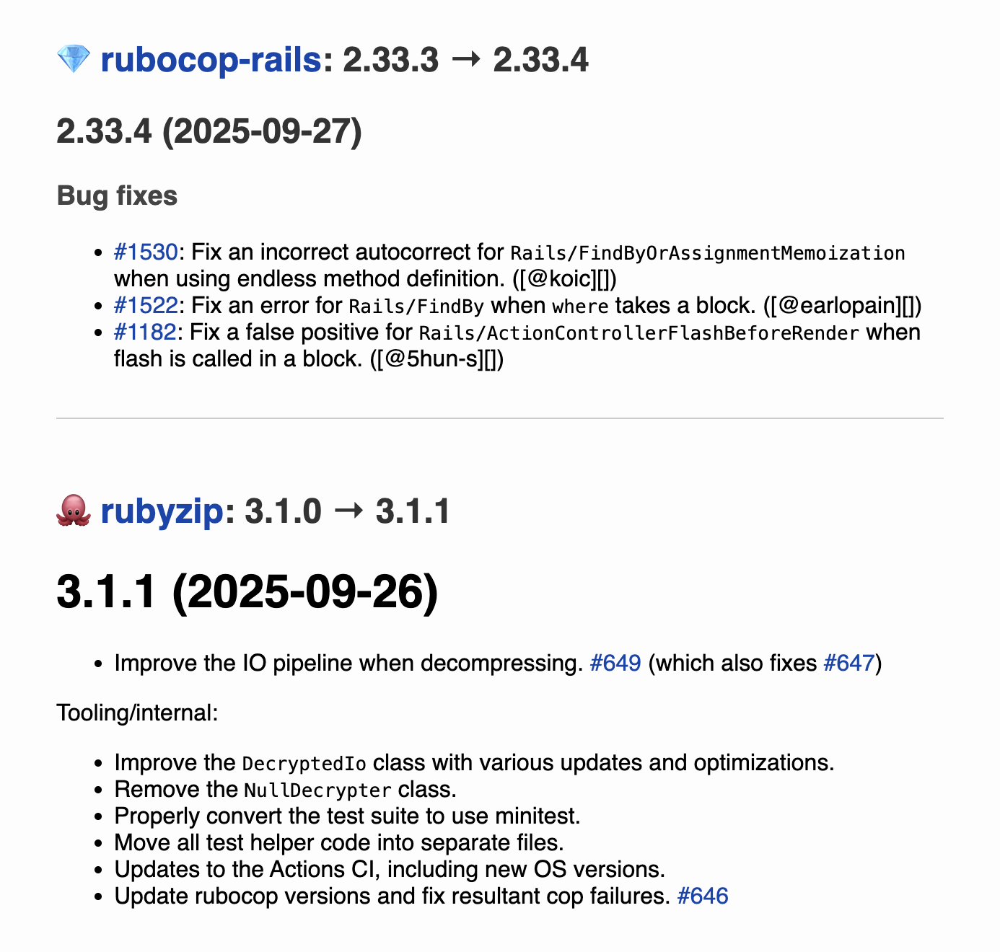

[](https://rubygems.org/gems/gemstar)
[](https://github.com/palkan/gemstar/actions)
[](https://github.com/FDj/gemstar/actions)

# Gemstar
A very preliminary gem to help you keep track of your gems.

## Installation

The easiest way to install gemstar is to use Bundler:

```shell
# Shell
gem install gemstar
```

Alternatively, add it to the development group in your Gemfile.

## Usage

### gemstar diff

Run this after you've updated your gems.

```shell
# in your project directory, after bundle update:
gemstar diff
```

This will generate an html diff report with changelog entries for each gem that was updated:



You can also specify from and to hashes or tags to generate a diff report for a specific range of commits:

```shell
gemstar diff --from 8e3aa96b7027834cdbabc0d8cbd5f9455165e930 --to HEAD
```

To examine a specific Gemfile.lock, pass it like this:

```shell
gemstar diff --lockfile=~/MyProject/Gemfile.lock
```

## Contributing

Bug reports and pull requests are welcome on GitHub at [https://github.com/FDj/gemstar](https://github.com/FDj/gemstar).

## Credits

This gem is generated via [`newgem` template](https://github.com/palkan/newgem) by [@palkan](https://github.com/palkan).

## License

The gem is available as open source under the terms of the [MIT License](http://opensource.org/licenses/MIT).
