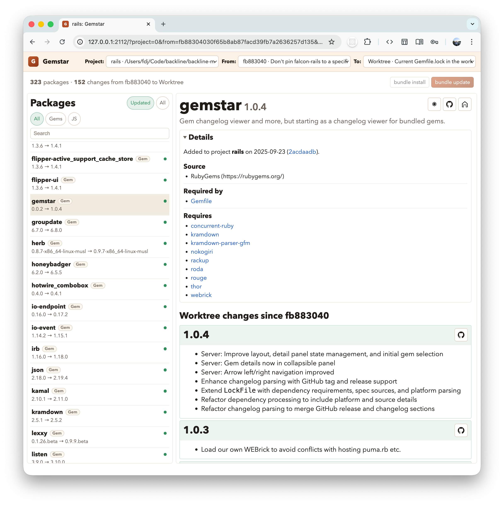
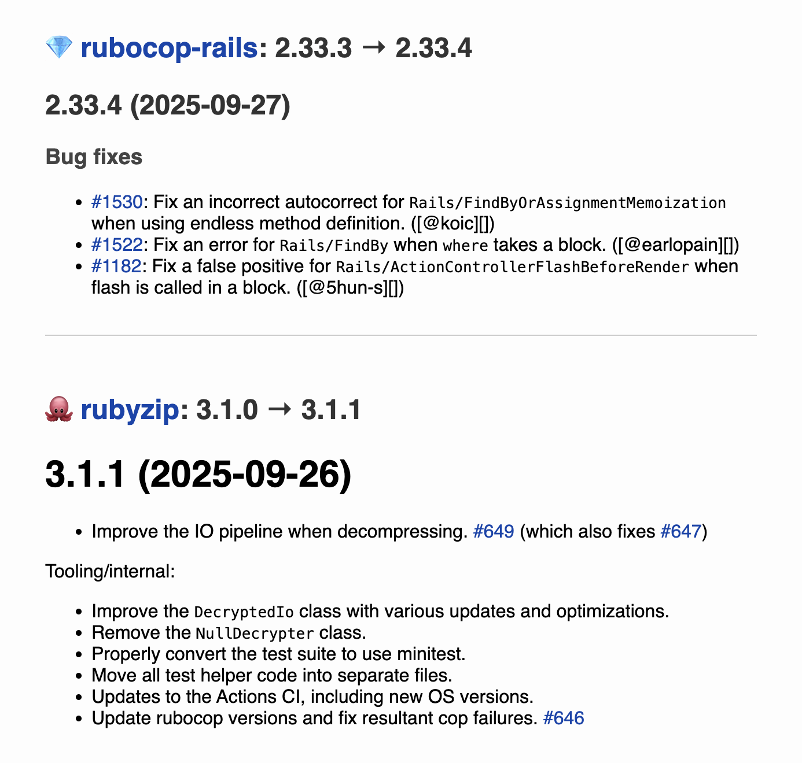

[](https://rubygems.org/gems/gemstar)
[](https://github.com/palkan/gemstar/actions)
[](https://github.com/FDj/gemstar/actions)

# Gemstar
Helps you keep track of your Ruby gems, JavaScript packages, Python packages, and Rust crates.

## Installation

If you use mise, as you should:

```shell
mise use -g ruby
mise use -g gem:gemstar@latest
gemstar
```

This will first install Ruby and then gemstar through mise's gem backend.

Or if you're using Ruby:

```shell
gem install gemstar
gemstar
```

You can also add gemstar to your Gemfile:

```rb
gem "gemstar", group: :development
```

## Usage

### gemstar

This starts the interactive web UI:



By default, the server listens on http://127.0.0.1:2112/. To customize settings, see the built-in help:

```shell
gemstar help server
```

### gemstar diff

Run this after you've updated your dependencies.

```shell
# in your project directory, after bundle update:
gemstar diff
```

This will generate an html diff report with changelog entries for each updated package:



You can also specify from and to hashes or tags to generate a diff report for a specific range of commits:

```shell
gemstar diff --from 8e3aa96b7027834cdbabc0d8cbd5f9455165e930 --to HEAD
```

To use a time range instead of choosing the starting commit yourself:

```shell
gemstar diff --project ~/Code/my-app --since "3 weeks ago"
```

To examine a specific Gemfile.lock, pass it like this:

```shell
gemstar diff --lockfile=~/MyProject/Gemfile.lock
```

To diff a project from anywhere, pass the project directory or a supported project file. In project mode, gemstar includes Ruby gems, JS packages from `importmap.rb` and `package-lock.json`, Python packages from `uv.lock`, and Rust crates from `Cargo.lock` when present:

```shell
gemstar diff --project ~/Code/my-app
```

To filter a project diff down to one ecosystem:

```shell
gemstar diff --project ~/Code/my-app --ecosystem js
gemstar diff --project ~/Code/my-app --ecosystem gems
gemstar diff --project ~/Code/my-app --ecosystem python
gemstar diff --project ~/Code/my-app --ecosystem cargo
```

To write markdown instead of html:

```shell
gemstar diff --format markdown
```

## Contributing

Bug reports and pull requests are welcome on GitHub at [https://github.com/FDj/gemstar](https://github.com/FDj/gemstar).

## Credits

This gem is generated via [`newgem` template](https://github.com/palkan/newgem) by [@palkan](https://github.com/palkan).

## License

The gem is available as open source under the terms of the [MIT License](http://opensource.org/licenses/MIT).
